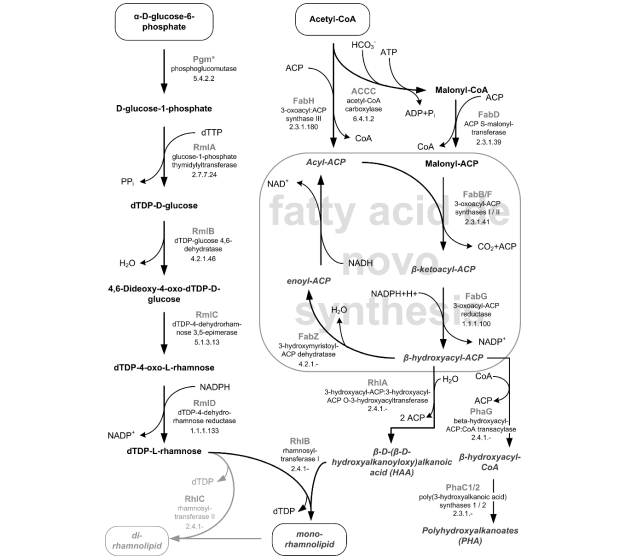

# Project

## Context
This GitHub repository was created to support the development of the project "Reconstruction of Pseudomonas putida metabolic pathway for rhamnolipids biosynthesis", within the scope of the Bioinformatics and Systems Biology project. The mais goal of this work is to replicate the rhamnolipids pathway originally existent in *Pseudomonas aeruginosa* into *Pseudomonas putida* in order to produce rhamnolipids, using the metabolic engineering tool, MEWpy.

## Abstract
Biosurfactants produced by several microbes exhibit various advantages as compared to petrochemical surfactants. Although *Pseudomonas aeruginosa* has been used as the model organism for their production, the complex regulatory network controlling the rhamnolipid production and its classification as an opportunistic pathogen are major downsides, thus highlighting *Pseudomonas putida* as an alternative producing host. This project aims to reconstruct the rhamnolipids pathway, present in the figure below, originally existent in *Pseudomonas aeruginosa* into *Pseudomonas putida* using metabolic engineering tools such as MEWpy, which allows to model and optimize microbial production on Genome-Scale Metabolic Models.

